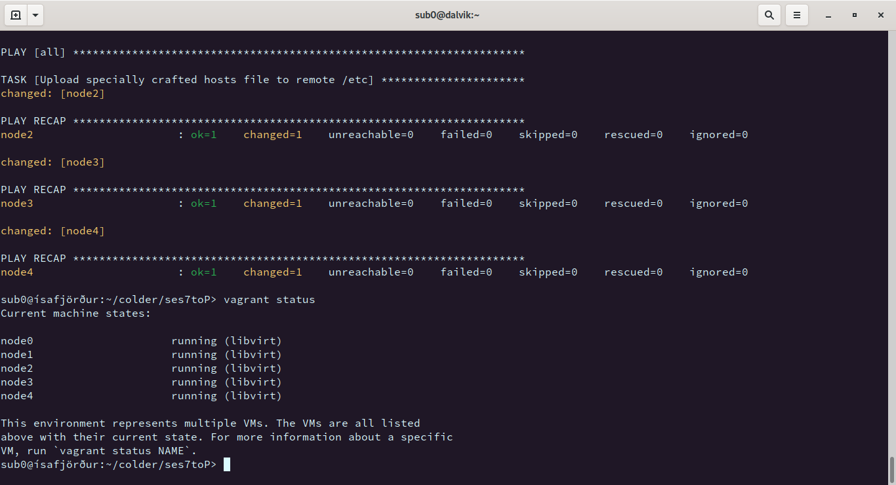
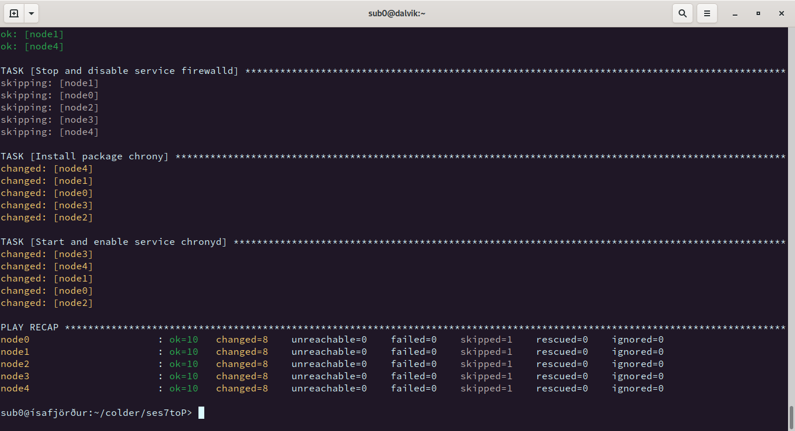
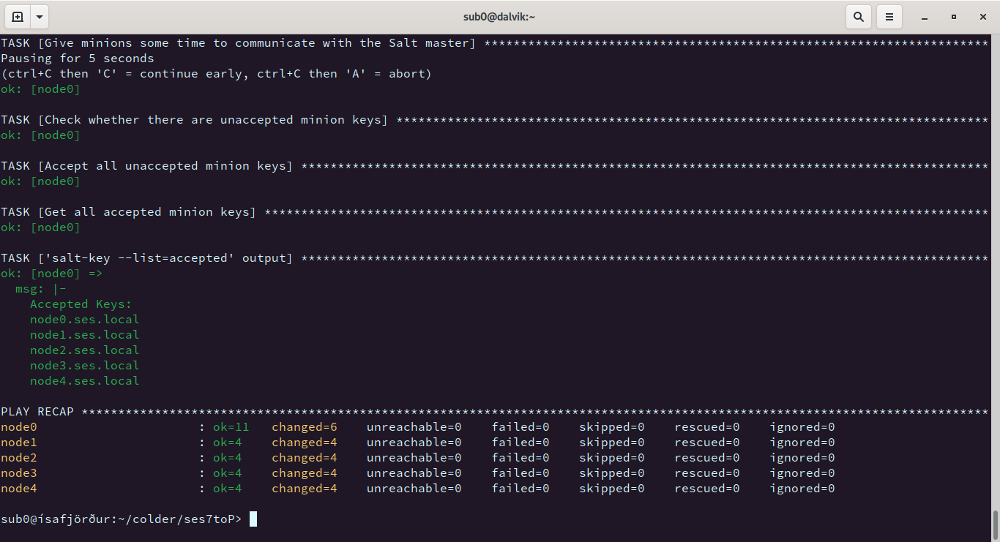
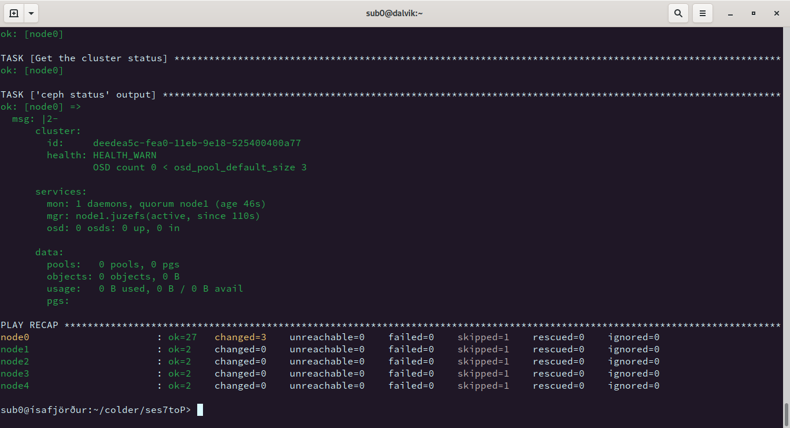
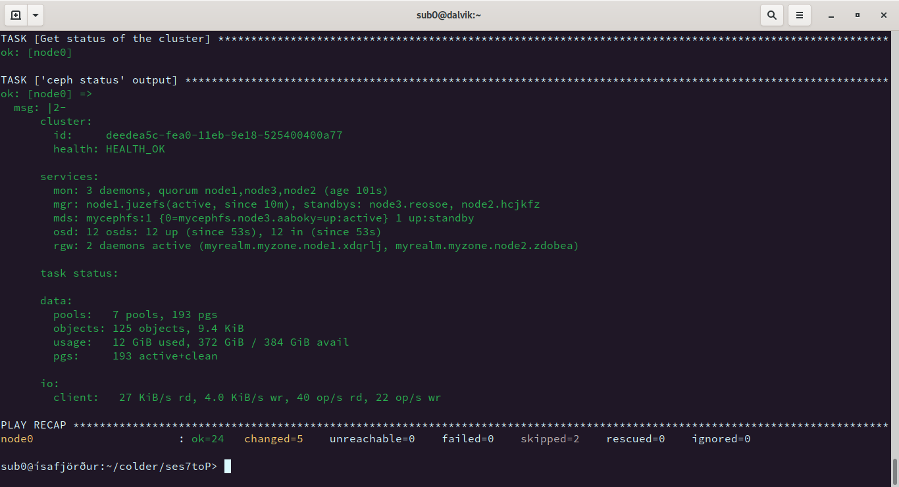
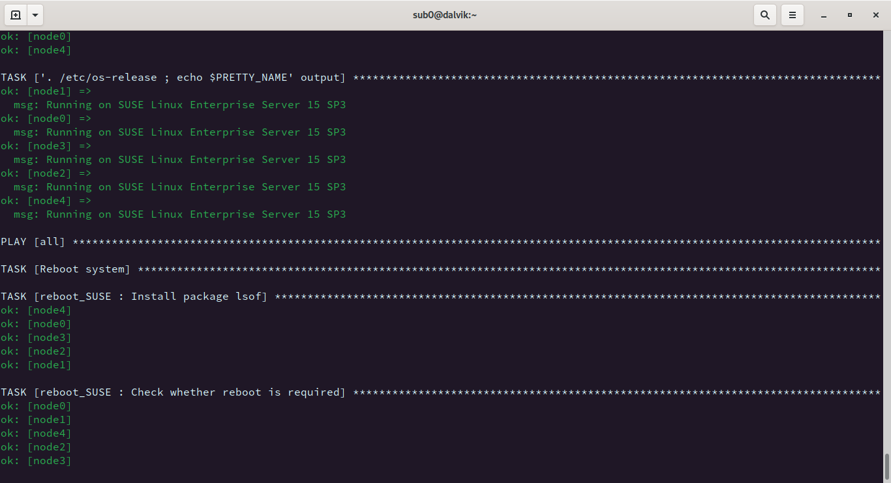
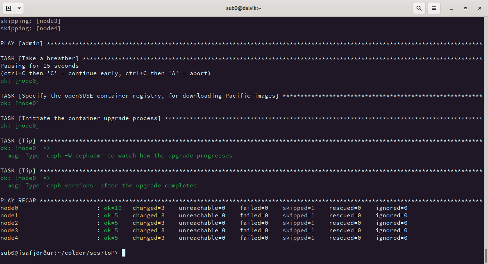
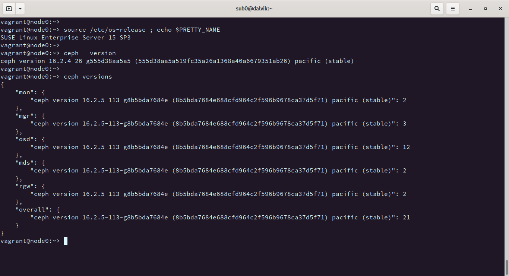

# SES7P Playground

#### A collection of Vagrant files, Ansible playbooks, and Ansible roles for simulating manual deployments of SUSE Enterprise Storage 7 clusters -- and also testing the upgrade process to SUSE Enterprise Storage 7 Pacific.

## Table of Contents

* [About](#about)
* [Getting Started](#getting-started)
  * [Ansible](#ansible)
  * [VirtualBox](#virtualbox)
  * [Libvirt](#libvirt)
  * [Vagrant & vagrant-libvirt](#vagrant--vagrant-libvirt)
  * [Download Vagrant boxes](#download-vagrant-boxes)
* [Node & networking config](#node--networking-config)
* [Spawn cluster nodes](#spawn-cluster-nodes)
* [Get nodes ready for SES](#get-nodes-ready-for-ses)
* [Bootstrap the cluster](#bootstrap-the-cluster)
* [Deploy services](#deploy-services)
* [Upgrade to SLE 15 SP3](#upgrade-to-sle-15-sp3)
* [Upgrade to SES 7 Pacific](#upgrade-to-ses-7-pacific)

## About

This is a collection of Vagrant files, Ansible playbooks, and Ansible roles for simulating manual deployments of SUSE Enterprise Storage 7 (SES 7) clusters, as described in the [official guide](https://documentation.suse.com/ses/7/html/ses-all/book-storage-deployment.html) provided by [SUSE](https://www.suse.com). Additionally, we simulate the upgrade process from SES 7 Octopus to SES 7 Pacific.

> The upgrade process implemented in this project is not necessarily identical to the officially supported method of upgrade. Our primary concern, though, remains the early detection and report of glitches and bugs when migrating from SES 7 Octopus to SES 7 Pacific.

> All package repositories and all Vagrant boxes used in this project are hosted in the Internal SUSE Build System (IBS), so to play along you need access to the SUSE R&D network.

## Getting Started

First off, you need a Linux or a macOS host with Ansible and Vagrant installed. Regarding virtualization support, when using Linux you can go either with libvirt or with VirtualBox. When using macOS you can only go with VirtualBox.

During our early testing we tried various deployments on a workstation and a laptop running openSUSE Leap 15.2 and openSUSE Leap 15.3 respectively, and also on one laptop running macOS Big Sur. Installed on each physical host we had the latest available versions of all required software (Ansible, Vagrant, vagrant-libvirt, VirtualBox).

### Ansible

Please check the official [installation instructions](https://docs.ansible.com/ansible/latest/installation_guide/intro_installation.html) for your host OS.

### VirtualBox

In case you are working on a physical host with macOS, then as far as this project is concerned VirtualBox is your only choice of hypervisor. So either get VirtualBox from the [official site](https://www.virtualbox.org), or install it from the command line using a system like [Homebrew](https://brew.sh).

While you can definitely use VirtualBox on a Linux host, it is recommended that you do not and go the libvirt route instead. That way your whole setup consumes noticeably fewer hardware resources and you get better performance at the same time.

### Libvirt

Follow the instructions for your distribution to install and --most importantly-- properly configure [libvirt](https://libvirt.org). On openSUSE Leap, you can either turn to YaST (you need to have package `yast2-vm` installed) or work from the command line like this:

```
sudo zypper -n in -t pattern kvm_server kvm_tools
sudo systemctl enable libvirtd
sudo systemctl restart libvirtd
sudo usermod -a -G libvirt $USER
```

To make sure your `$USER` is a member of the `libvirt` group, log out and immediately log back in.

### Vagrant & vagrant-libvirt

When working on a macOS host, either go get Vagrant from the [official site](https://www.vagrantup.com) or install it from the command line using, for example, the [Homebrew](https://brew.sh) project. You will not need any extra Vagrant plugins.

When working on a Linux host, install Vagrant **along** with the [vagrant-libvirt](https://github.com/vagrant-libvirt/vagrant-libvirt) plugin, using the package manager of your distribution. If you are on openSUSE Leap, in order to have up-to-date versions of Vagrant and vagrant-libvirt it is recommended to first add an extra repository from OBS and then install the corresponding packages. In the case of Leap 15.3, for example, we first added [this repository](https://download.opensuse.org/repositories/Virtualization:/vagrant/openSUSE_Leap_15.3) and then went on and, using `zypper`, installed packages `vagrant` and `vagrant-libvirt`. 

### Download Vagrant boxes

For our testing we use specific Vagrant boxes with SLE 15 SP2, which reside in IBS. There are actually two boxes we can use, one for libvirt and one for VirtualBox.

#### Box for libvirt:

```
vagrant box add --provider libvirt --name sles15sp2 \
  http://download.nue.suse.com/ibs/Virtualization:/Vagrant:/SLE-15-SP2/images/\
  SLES15-SP2-Vagrant.x86_64-libvirt.box
```

#### Box for VirtualBox:

```
vagrant box add --provider virtualbox --name sles15sp2 \
  http://download.nue.suse.com/ibs/Virtualization:/Vagrant:/SLE-15-SP2/images/\
  SLES15-SP2-Vagrant.x86_64-virtualbox.box
```

> Even if you download and install both Vagrant boxes on the same host, you can still assign the same name to both of them. Vagrant is intelligent enough to pick the box suitable for the hypervisor being used.

## Node & networking config

On the host you are going to be working on, clone the ses7toP repository and change into the new directory.

To deploy a set of VMs which, in a bit, are going to be members of a virtual SES 7 cluster, first take a look into the `params/setup.yml` file. All parameters are documented into said file. You may want to make some changes here and there, for example regarding the total number of nodes, the RAM allocated to each node, or the number of OSD disks each but the first node has.

The defaults lead to a five-node cluster. The first node (`node0`) is the only one with no OSD disks and always doubles as the admin node. The second node (`node1`) always doubles as the bootstrap node, while all the rest host various Ceph services. More on those services in a bit.

You might want to change the parameters regarding the public and the cluster networks (`public_net_prefix` and `cluster_net_prefix` respectively). In any case, make sure there are no conflicts with existing virtual networks on your host.

## Spawn cluster nodes

Make sure you have a symlink named `Vagrantfile` pointing to the actual Vagrant file for your hypervisor of choice. So when you use VirtualBox then `Vagrantfile` should be pointing to `Vagrantfile.virtualbox`, and when you use libvirt then `Vagrantfile` should be pointing to `Vagrantfile.libvirt`.

Then, just `vagrant up` your environment.

After a while you should have all fine nodes running, each with an automatically generated `/etc/hosts` file containing all necessary information so every single node is reachable from any other node by IP/hostname/FQDN. (This is thanks to playbook `provision.yml`, which is called right after each VM gets ready.) Also, in the current directory of your physical host you will have a `hosts` file, for Ansible to make use of. (This is thanks to playbook `inventory.yml`, which is called once after the last VM gets ready.)

*Vagrant just completed bringing up all cluster nodes*

## Get nodes ready for SES

The Vagrant boxes we use come without repositories. So at this early stage we have to add repositories for the OS, the module(s), and the product(s), to each and every single one of our running nodes. (All those repositories are defined in `params/repos_sle.yml` and in `params/repos_ses.yml`.) For this and some other tasks we have the playbook named `prepare.yml`, and to execute it we type:

```
ansible-playbook -i hosts prepare.yml
```

*All nodes have been properly prepared for SES*

In SES, for the initial cluster preparation we use Salt and `ceph-salt` (see paragraph 5.2, [Deploying Salt](https://documentation.suse.com/ses/7/html/ses-all/deploy-cephadm.html#deploy-salt), in the official documentation). For properly installing Salt master and minions on respective nodes, point the minions to the master and, finally, have the master accept the minion keys, we have a playbook named `saltify.yml`:

```
ansible-playbook -i hosts saltify.yml
```

*All Salt minion keys have been accepted by the Salt master, which is running on the admin node*

We are now ready to bootstrap the cluster.

## Bootstrap the cluster

In the context of SES, _bootstrapping_ means creating a minimal cluster in which there is only one node --non-surprisingly named _bootstrap node_-- which hosts one Ceph monitor and one Ceph manager service. Bootstrapping is a "day 1" operation and to execute it we just have to type this:

```
ansible-playbook -i hosts day1.yml
```

*At the end of the day 1 our minimal cluster is ready and **mostly** healthy: there's only one warning regarding the number of OSDs, for we have none yet!*

## Deploy services  

When the cluster has finished bootstrapping we are ready for "day 2" operations. First off, we have to deploy OSDs. In our scenario, each of the nodes but the first has a number of OSD disks and all those disks are automatically consumed. Besides the OSD services we deploy additional monitors and managers, Metadata servers, RADOS gateways, etc. The type and number of individual services we can currently deploy is defined in `params/services.yml`, and day 2 operations start like this:

```
ansible-playbook -i hosts day2.yml
```

*At the end of the day 2 we have a full-blown SES 7 cluster to play with*

## Upgrade to SLE 15 SP3

To go from SLE 15 SP2 to SLE 15 SP3 we...

* remove repositories from all cluster nodes, keeping only those for SES 7 (the repositories we remove are defined in `params/repos_sle.yml`)
* add to all cluster nodes new repositories for SLE 15 SP3 (those are defined in `params/repos_sle_new.yml`)
* perform distribution upgrade to all nodes
* reboot nodes, if necessary

For all the above steps we have playbook `upgrade2sp3.yml`:

```
ansible-playbook -i hosts upgrade2sp3.yml
```

*All cluster nodes have successfully been upgraded to SLE 15 SP3*

## Upgrade to SES 7 Pacific

The upgrade process to SES 7 Pacific is documented in playbook `seven2p.yml`:

* remove SES 7 repositories from all cluster nodes (those repositories are defined in `params/repos_ses.yml`
* add to all cluster nodes new repositories for SES 7 Pacific (defined in `params/repos_ses_new.yml`)
* perform package updates on each and every single one of the cluster nodes
* reboot nodes, if necessary
* from the admin node, use ceph-salt to specify the openSUSE container registry for downloading Pacific images (said registry is defined in `params/`)
* from the admin node, initiate the upgrade process for all SES 7 containers to SES 7 Pacific containers

To start the transition to Pacific, just type:

```
ansible-playbook -i hosts seven2p.yml
```

*The playbook for upgrading to SES 7 Pacific finishes relatively fast but the whole process takes much longer because, if anything, the new containers have to be downloaded and replace the respective old ones*

*The upgrade process to SES 7 Pacific has finished and now we're checking versions*
